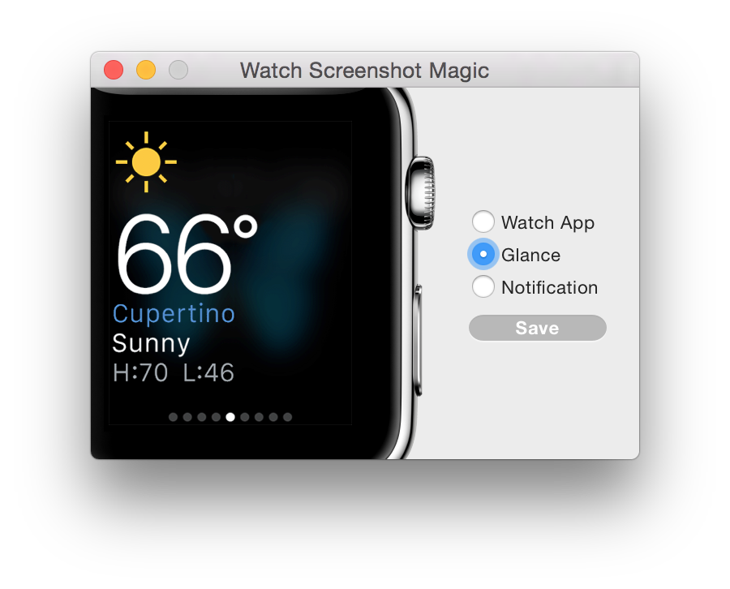
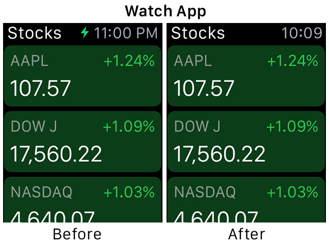
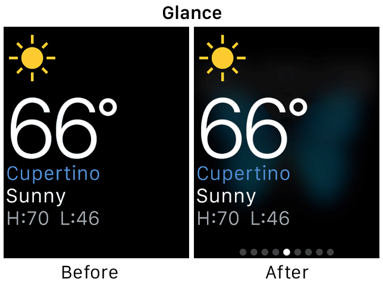
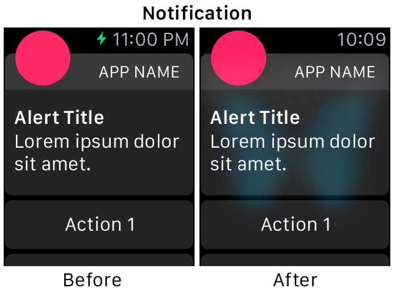

# Watch Screenshot Magic

Quickly generates perfect Apple Watch screenshots from the simulator. Simply provide a screenshot from the 42mm simulator and choose the correct type.

## Watch App

* Removes charing indicator from status bar
* Changes clock to read "10:09"

## Glances

* Overlays on blurred watch face
* Adds page indicator

## Notifications

* Overlays on blurred watch face
* Removes charing indicator from status bar
* Changes clock to read "10:09"

__Note:__ The method used to overlay notifications on a blurred watch face is not 100% accurate. The body of a notification generally has some alpha content allowing visibility of the watch face, simulated here with a screen composition.
